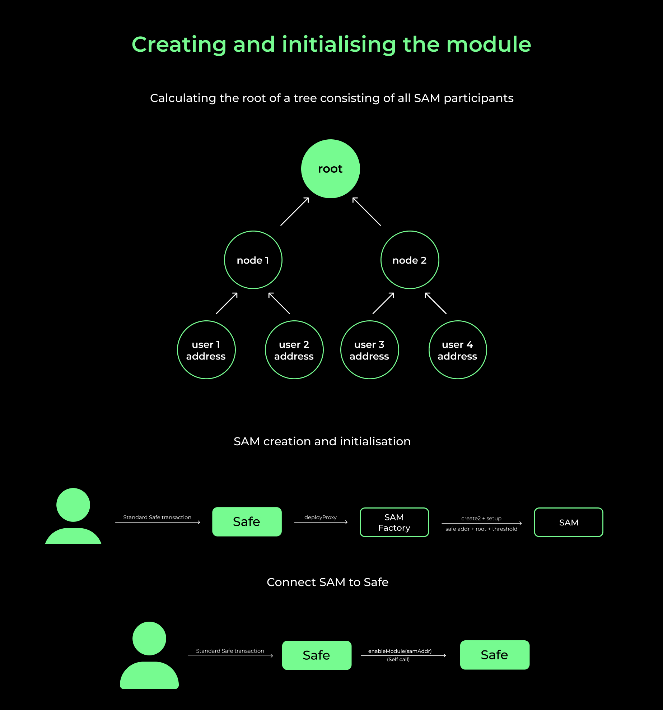
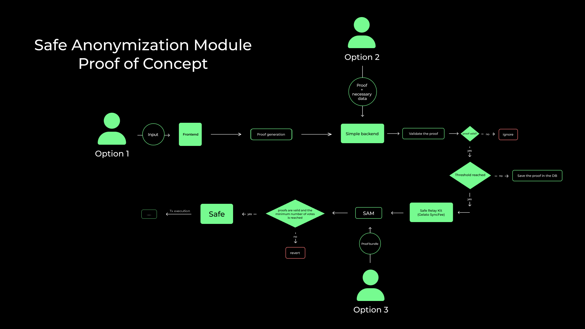

# Safe Anonymization Module

## Description

This is an implementation of the PoC contract for the Safe Wallet grant.

Our key concept is centered around the creation of a module for Safe multisig that ensures the anonymity of all its participants using ZK-SNARK technology.

The details are described in:

- [Proposal](https://oxorioteam.notion.site/Safe-Anonymization-Module-proposal-efe966603632482abf243283bfc78897)
- [Research](https://oxorioteam.notion.site/Safe-Anonymization-Module-1-M-1e702d426bfd46a4aa89b463d2b81d2c)

## Requirements

- Foundry

## Installation

To get started with this project, you need to install Foundry. Follow the instructions [here](https://book.getfoundry.sh/getting-started/installation).

```bash
git clone https://github.com/oxor-io/sam-contracts.git
cd sam-contracts
foundryup
forge install
```

## Testing

Before running tests, you will need to set up an `.env` file in the project root with an Ethereum API key. Create a `.env` file and add the following:

```
MAINNET_RPC={your-ethereum-api-key}
```

Replace `your-ethereum-api-key` with your actual API key. Then, you can run tests with the following command:

```bash
forge test
```

## Proof generation

For detailed instructions on how to generate a proof, refer to the repository with [circuit](https://github.com/oxor-io/sam-circuits).

## Workflow

1. **Deployment and Initialization of the User Module**

   Our module incorporates a proxy pattern, deployed through the SAM Factory using one of the following methods:

   - `createProxyWithNonce`
   - `createChainSpecificProxyWithNonce`
   - `createProxyWithCallback`

   > Refer to the documentation for detailed descriptions of each method.

   For initialization, you can pass a payload when calling one of the aforementioned functions, which will then be executed by the newly created module. The information provided must align with the function call:

   ```solidity
   function setup(address safe, uint256 participantsRoot, uint64 threshold) external;
   ```

2. **Connecting the Module to Safe**

   To link a module to Safe, Safe must invoke `enableModule`, passing the address of the created proxy as an argument.

   

3. **Transaction Execution Approval**

   You can pre-approve a transaction execution. In this case, you need to provide all transaction parameters, including the `nonce` (the transaction number for the module account), and a set of proofs. The number of counted votes is proportional to the number of proofs submitted.

   ```solidity
   function approveHash(
       address to,
       uint256 value,
       bytes memory data,
       ISafe.Operation operation,
       uint256 nonce,
       Proof[] calldata proofs
   ) external;
   ```

4. **Executing the Transaction**

   A transaction can only be executed once the proof threshold is met. This can occur through:

   - Submission of all proofs directly to one of the transaction execution functions.
   - Granting permission for transaction execution using the `approveHash` function.
   - A hybrid approach combining the above methods.

   There are two transaction execution functions:

   ```solidity
   function executeTransaction(
       address to,
       uint256 value,
       bytes memory data,
       ISafe.Operation operation,
       Proof[] calldata proofs
   ) external returns (bool success);

   function executeTransactionReturnData(
       address to,
       uint256 value,
       bytes memory data,
       ISafe.Operation operation,
       Proof[] calldata proofs
   ) external returns (bool success, bytes memory returnData);
   ```

   The primary distinction is that the second function also returns the data from the transaction execution, while the first only returns the execution status.

   

5. **Changing Module Parameters**

   Two contract parameters can be modified:

   - `threshold`: the required number of votes to execute a transaction.
   - `participantsRoot`: the root of the Merkle tree containing all participant addresses.

   The following function is used to modify these parameters:

   ```solidity
   function file(bytes32 what, uint256 value) external;
   ```

   Here, `what` represents either "root" or "threshold" in bytes32 type, depending on which parameter you wish to modify.

   > Note: at this point, only the associated Safe can make changes.

## Disclaimer

The code provided in this repository has not undergone a security audit. It is provided "as is" and without any warranty.

## License

This project is licensed under the GNU General Public License v3.0 - see the [LICENSE](LICENSE) file for details.
